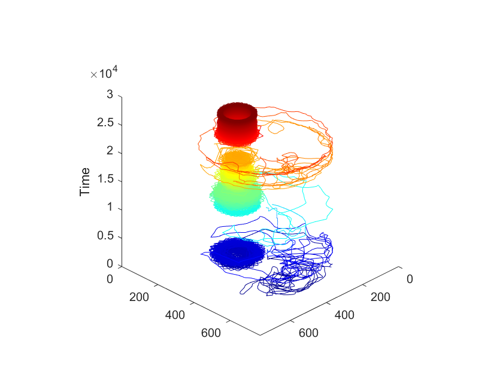

# DrosoCarousel

`DrosoCarousel` is a software to analyze DrosoCarousel experiments.
A single *Drosophila melanogaster* fly is staying in an enriched environment with access to food and a turning platform. Videos are tracked with [DeepLabCut](https://github.com/DeepLabCut/DeepLabCut) and the interaction of the fly with its environment is further analyzed.

# Usage

`CaroDataHandleList.m` is used to analyze and plot experiments with a single rotating disk, `DoubleCaroDataHandleList.m` is the version for experiments with two intermittantly rotating disks.

`GenericDataHandleList.m` and `CaroInterface.m` are helper classes for `CaroLoader`,`CaroDataHandleList` and `DoubleCaroDataHandleList`.

`CaroLoader.m` is used to load experiments that have been tracked with [DeepLabCut](https://github.com/DeepLabCut/DeepLabCut)

You can select two indexModes, `video` and `frame`. With the `video` setting, `expt.plotWalkingTrace(1:3)` will plot the first three videos (e.g. 3*9000 frames), while with the `frame` setting, `expt.plotWalkingTrace(2000:3000)` will plot only the frames 2000 to 3000.

Default settings can be provided in `defaultSettings.json`:\
`indexMode`: default index mode, `video` or `frame`,\
`imageResX`, `imageResY`: resolution of the video images\
`occupancyScale`: scaling factor for occupancy plots, can also be set in method\
`ringWidth`: width of the ring around the carousel\
`borderWidth`: width of the border zone at the rim of the arena\
`borderBuffer`: outer part of the border zone, unreachable for the fly due to the shape of the glass lid\
`minActivity`: minimum of movement (pixel) for the fly to be considered active\
`maxMoveDist`: maximum of expected fly movement\
`minVisitLength`: minimum vistit length (in frames) on ROI to be included in analysis (cutoff)\
`roiGapMax`: maximum gap between two stays on the same ROI to be ignored, the two stays will be merged\

**Please cite as**:

    @article{Triphan_Huetteroth.2023,
        author = {Triphan, Tilman and Huetteroth, Wolf},
        title = {Voluntary passive movement in flies is play-like behavior},
        year = {2023},
        doi = {10.1101/2023.08.03.551880},
        URL = {https://www.biorxiv.org/content/10.1101/2023.08.03.551880v2},
        journal = {bioRxiv}
    }	